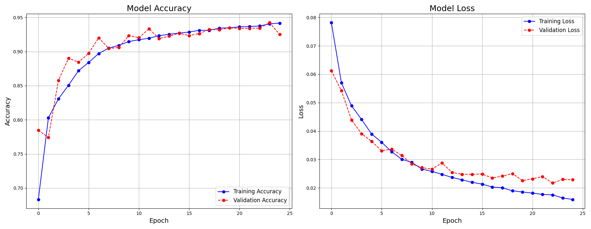
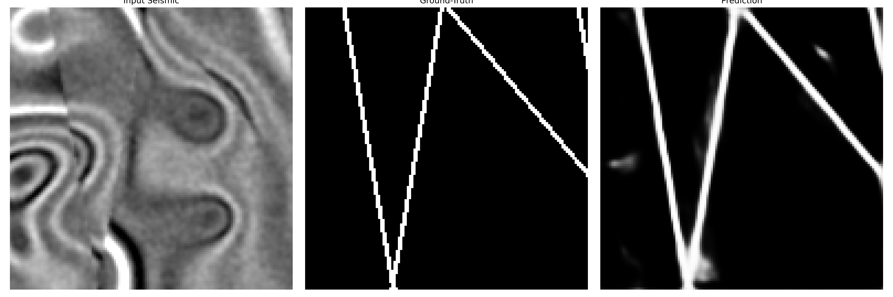
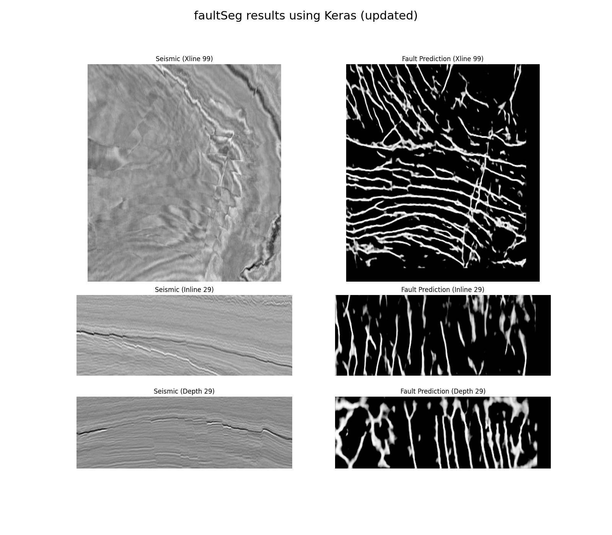
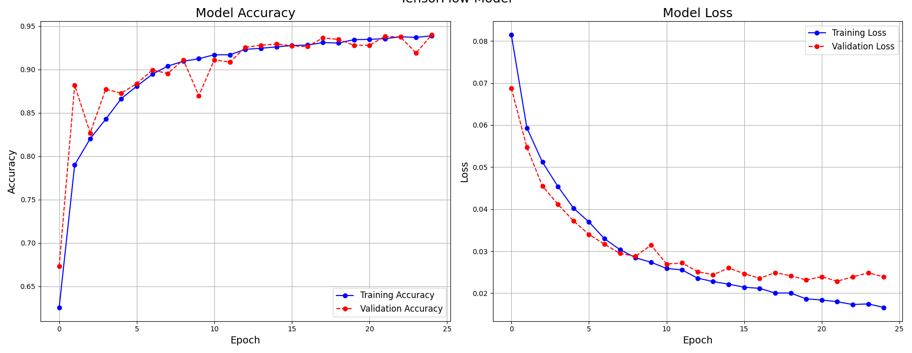
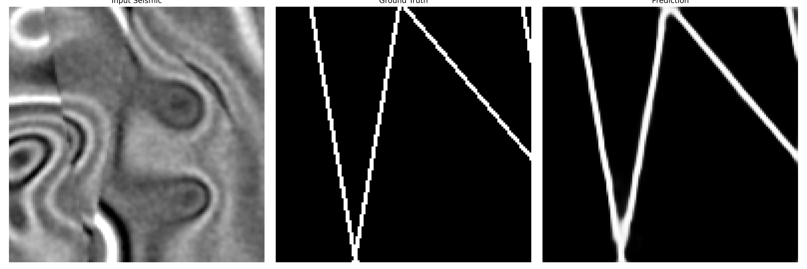
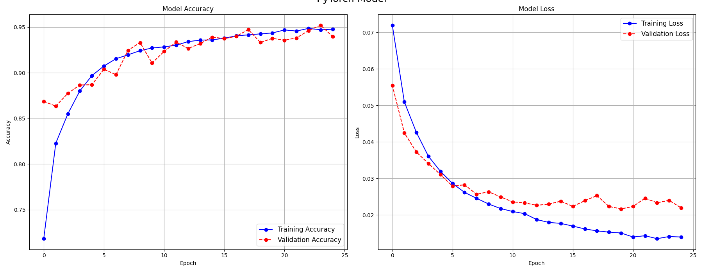

# FaultSeg: Seismic Fault Segmentation with U-Net

This repository contains implementations of a U-Net based model for seismic fault segmentation, based on the work of Wu et al. (2019). It includes the original Keras implementation, an updated Keras version, and implementations in TensorFlow and PyTorch.

## Project Structure

The repository is organized into the following main directories:

- `faultSeg_2019_keras_original`: The original code from Wu et al. (2019).
- `faultSeg_2019_keras_updated`: An updated and refactored version of the original Keras code.
- `faultSeg_2019_tensorflow`: A TensorFlow implementation of the U-Net model.
- `faultSeg_2019_pyTorch`: A PyTorch implementation of the U-Net model.

## Original Work and Reference

The code in `faultSeg_2019_keras_original` is based on the following paper:

- **Title:** FaultSeg: A Semiautomatic 3D Seismic Fault Segmentation Method
- **Authors:** Xinwu Wu, Luming Liang, Yuting Xiong, and Hongyan Yang
- **Year:** 2019
- **Official GitHub Repository:** [https://github.com/xinwucwp/faultSeg](https://github.com/xinwucwp/faultSeg)

The original Keras implementation uses older versions of the library. For compatibility with newer environments, a refactored version is available in the `faultSeg_2019_keras_updated` directory.

## Dataset

The model is trained on a synthetic dataset consisting of 200 training pairs and 20 validation pairs, as proposed by Wu et al. (2019). You can download the dataset from the following link:

- **Dataset Link:** [https://drive.google.com/open?id=1I-kBAfc_ag68xQsYgAHbqWYdddk4XHHd](https://drive.google.com/open?id=1I-kBAfc_ag68xQsYgAHbqWYdddk4XHHd)

## Requirements

All the necessary libraries and dependencies for this project are listed in the `requirements.txt` file.

## Model Implementations and Results

This repository provides three different implementations of the U-Net model for fault segmentation. The training history for each model is shown below.

### Keras Implementation

**Location:** `/home/roderickperez/DS_PROJECTS/faultSeg/faultSeg_2019_keras_updated`

### TensorFlow Implementation

**Location:** `/home/roderickperez/DS_PROJECTS/faultSeg/faultSeg_2019_tensorflow`

### PyTorch Implementation

**Location:** `/home/roderickperez/DS_PROJECTS/faultSeg/faultSeg_2019_pyTorch`

As shown in the plots, all three models achieve comparable performance on the validation set, demonstrating high accuracy and low loss after 25 epochs.

## Code Description (`faultSeg_2019_keras_original`)

The original implementation by Wu et al. (2019) includes the following key files:

- `train.py`: Script for training the U-Net model.
- `apply.py`: Script to apply the trained model for fault prediction on seismic data.
- `unet3.py`: Contains the implementation of the 3D U-Net model architecture.
- `utils.py`: Provides utility functions for data loading, preprocessing, and other helper tasks.
- `prediction.ipynb`: A Jupyter notebook for visualizing and running predictions with the trained model.
